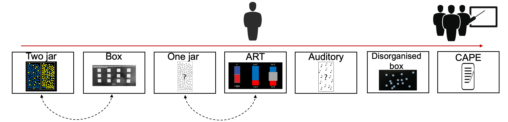

<h1>Introduction</h1>

_The picture displayes the test-session, following the red line. You got the tasks in slightly different ways (indicated by the dotted lines), and where tested by one of three different experimenters_.
  
This page contains a debrief for a project in probabilistic reasoning, in which you participated in 2018.
  
In the session you completed a total of six tasks, one questionnaire, and a post-session debrief. Most tasks (referred to as "Jar-tasks" and "Box-tasks"), are tasks in which you gathered information before reaching a decision (i.e., information sampling tasks). In addition there were one task made to measure risk-, and ambiguity-aversion, and a questionnaire made to measure psychotic-like experiences in a healthy population.
  
The overall project is looking at a (potential) link between degree of information sampling before making a decision in different test paradigms, risk-, and ambiguity aversion, and degree of psychotic-like experiences. As we collected additional data, and with some expanded tasks in 2020, the final results are not ready yet, and you will only be provided with your scores across the tasks, and not any further analysis. However if you wish to see how the project ends up, go to the About-tab to sign up.
<h3>Be aware!</h3>
**It's very important to remember that none of these tasks are clinical measurements, nor ment to be used for any diagnostic setting. They are simple, fast, easy to administer, _research_ tools.**
  
**It's also very important to note that these measurements are to be used for group-level analysis. We will provide you with your scores across the tasks, however no inference should be drawn on an individual level. They are simply displayed for fun, as many participants asks for these.**
  
If you wish to see your own scores across the tasks, please click the box to indicate that you do understand the information above, and then fill in your personal participant-ID.